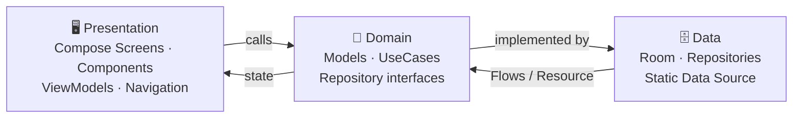

<div align="center">

# 🎬 Movies App Showcase

### A next-gen **Spatial Cinema & Streaming** experience for Android

*Holographic feeds • 360° spatial player • Multi-size widgets • Clean Architecture*

-3DDC84?logo=android&logoColor=white)


</div>

---

## ✨ Highlights

| | |
|:---|:---|
| 🪐 **Immersive Discovery** | Dynamic Compose UI with holographic rank cards, spatial audio cards & animated equalizer wave bars |
| 📺 **Multi-Size App Widgets** | 2×2 quick-resume, 4×2 now-playing with progress bar, and 4×4 cinema hub — built on `AppWidgetProvider` + `RemoteViews` |
| ▶️ **Media Playback** | Media3 / ExoPlayer with a public CC-BY sample stream as a stand-in for licensed content |
| 📡 **Google Cast** | Cast integration with a custom `OptionsProvider`, expanded controller & media notifications |
| 🤖 **AI Agent-Ready** | `AppFunctions` service (signature-protected) exposing watchlist & playback actions to on-device assistants |
| 🌍 **i18n + RTL** | Localized in 🇬🇧 🇸🇦 🇬🇷 with automatic RTL layout support |
| 🌗 **Theming** | Cinematic Dark / Spatial Light / System — with quick language & theme dialog |
| 🔔 **Predictive Back** | NavigationEvent integration for modern back-gesture animations |

## 📸 Screenshots

| Theme | Home | Player | Details |
|:---|:---:|:---:|:---:|
| 🌗 **Cinematic Dark — Obsidian** | 🔜 | 🔜 | 🔜 |
| 🌕 **Spatial Light — Quartz** | 🔜 | 🔜 | 🔜 |

> 💡 *Screenshots coming soon — captures will be added here once finalized.*

## 🏗 Architecture

Strict Clean Architecture with SOLID principles and a `Resource` wrapper for predictable error handling:



```
app/src/main/java/com/nady/moviesapp/
├── 🚀 MainActivity.kt
├── 📡 cast/                  # Google Cast setup
├── 🗄 data/
│   ├── datasource/           # Static movie catalog
│   ├── local/                # Room DB, DAOs, entities
│   └── repository/           # Repository implementations
├── 💎 domain/
│   ├── agent/                # AppFunctions AI service
│   ├── model/                # Pure Kotlin models
│   ├── repository/           # Interfaces
│   └── usecase/              # Single-responsibility use cases
├── 🖥 presentation/
│   ├── components/           # Reusable Compose components
│   ├── navigation/           # Route definitions
│   ├── screens/              # Home, Explore, Details, Player, Spatial, MySpace
│   └── viewmodel/            # ViewModels + factory
├── 🎨 ui/theme/              # Colors, typography, themes
└── 📺 widget/                # 2x2, 4x2, 4x4 App Widgets
```

## 🧰 Tech Stack

| Layer | Tools |
|:---|:---|
| **UI** | Jetpack Compose, Material 3, Compose BOM, Navigation Compose |
| **Persistence** | Room 2.7 (KSP codegen) |
| **Media** | Media3 / ExoPlayer, Media3 Cast |
| **Networking** | Retrofit, OkHttp, Moshi (KSP codegen) *(declared for future use)* |
| **AI / Cloud** | Firebase AI, Firebase App Check *(ready to wire)* |
| **DI** | Manual constructor injection via `ViewModelFactory` |
| **Testing** | JUnit4, Robolectric, Roborazzi screenshot tests, Compose UI Test |

## 🚀 Getting Started

### Prerequisites

- **Android Studio** Narwhal or newer (AGP 9.x support)
- **JDK 17+**

### Setup

```bash
git clone https://github.com/mohamedelandy/moviesapp-android.git
cd moviesapp-android
```

1. **Configure secrets** *(optional — the app builds and runs without them)*:
   ```bash
   cp .env.example .env
   ```
   The build reads `.env` via the Secrets Gradle Plugin and exposes values as `BuildConfig` fields. `.env` is gitignored — **never commit it**.

2. **Open & run**: Open the folder in Android Studio → let Gradle sync → pick an emulator/device → `▶ Run` (or `Shift+F10`).

<details>
<summary>🛠 Or build from the command line</summary>

```bash
./gradlew :app:assembleDebug      # build APK
./gradlew :app:testDebugUnitTest  # unit + Robolectric tests
```
</details>

## 🧪 Testing

The codebase is structured for high testability — pure domain layer, injected repositories, and Robolectric for JVM-side Android tests.

```bash
./gradlew testDebugUnitTest         # Unit + Robolectric + screenshot tests
./gradlew connectedDebugAndroidTest # Instrumented & E2E tests
```

## 📄 License

Distributed under the MIT License. See [`LICENSE`](LICENSE) for more information.

## ⚠️ Disclaimer

This is an independent, educational showcase project. It is **not affiliated with,
endorsed by, or sponsored by Netflix, Inc.** or any other streaming provider. All
titles, characters, and loglines in the bundled sample data are fictional and
written for this project. The player streams a public CC-BY sample clip
("Big Buck Bunny", Blender Foundation) as a stand-in for a licensed stream. "Netflix" and "My List" are trademarks of their
respective owners and are used here only descriptively.

---

<div align="center">

*Built as a showcase for modern native Android development.* 🚀

</div>
