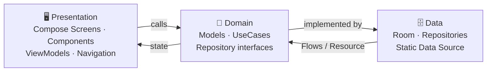

<div align="center">

# 🎬 Movies App Showcase

### A next-gen **Spatial Cinema & Streaming** experience for Android

*Holographic feeds • 360° spatial player • Multi-size widgets • Clean Architecture*

-3DDC84?logo=android&logoColor=white)


</div>

---

## ✨ Highlights

| | |
|:---|:---|
| 🪐 **Immersive Discovery** | Dynamic Compose UI with holographic rank cards (`HolographicRankCard`), spatial audio cards (`SpatialAudioCard`) & animated equalizer wave bars (`EqualizerWaveBar`) |
| 📺 **Multi-Size App Widgets** | 2×2 quick-resume, 4×2 now-playing with progress bar, and 4×4 cinema hub — built on `AppWidgetProvider` + `RemoteViews` layouts |
| ▶️ **Media Playback** | Media3 / ExoPlayer 1.5.1 with playback speed controls (0.5x–2.0x), audio spec indicators, and a public CC-BY sample stream as a stand-in for licensed content |
| 📡 **Google Cast** | Cast integration via Media3 Cast (`CastPlayer`) with a custom `CastOptionsProvider` and seamless remote session handoff |
| 🤖 **AI Agent-Ready** | Android `AppFunctions` service (`MoviesAppFunctionService`) with signature-level permission protection (`BIND_APP_FUNCTIONS`), exposing search, watchlist & playback actions to on-device assistants |
| 🌍 **Localization & RTL** | Native Android string resources (`res/values`, `res/values-ar`, `res/values-el`) supporting English 🇬🇧, Arabic 🇸🇦 (with dynamic RTL layout mirroring via `CompositionLocalProvider`), and Greek 🇬🇷 |
| 🌗 **Theming** | Cinematic Dark (Obsidian) / Spatial Light (Quartz) / System default — backed by Room database preferences and a quick language & theme dialog |
| 🔔 **Predictive Back** | Jetpack Compose `PredictiveBackHandler` integration with gesture progress tracking for smooth back navigation |

## 📸 Screenshots

| Theme | Home | Player | Details |
|:---|:---:|:---:|:---:|
| 🌗 **Cinematic Dark — Obsidian** | 🔜 | 🔜 | 🔜 |
| 🌕 **Spatial Light — Quartz** | 🔜 | 🔜 | 🔜 |

> 💡 *Screenshots coming soon — captures will be added here once finalized.*

## 🏗 Architecture

Strict Clean Architecture with SOLID principles and a `Resource` wrapper for predictable error handling:



```
app/src/main/
├── AndroidManifest.xml       # Permissions, CastOptionsProvider, AppFunctions, Widgets
├── java/com/nady/moviesapp/
│   ├── 🚀 MainActivity.kt    # Single activity, edge-to-edge, RTL composition, NavHost
│   ├── 📡 cast/              # CastOptionsProvider (Media3 Cast setup)
│   ├── 🗄 data/
│   │   ├── datasource/       # Static movie catalog & user profiles (offline-first)
│   │   ├── local/            # Room DB (AppDatabase, MovieDao, AppSettingEntity)
│   │   └── repository/       # Movie, Downloads & UserPreferences implementations
│   ├── 💎 domain/
│   │   ├── agent/            # MoviesAppFunctions & MoviesAppFunctionService (AppFunctions)
│   │   ├── model/            # Pure Kotlin domain models (Movie, Episode, AppSettings, Resource)
│   │   ├── repository/       # Repository domain interfaces
│   │   └── usecase/          # Single-responsibility use cases
│   ├── 🖥 presentation/
│   │   ├── components/       # HolographicRankCard, SpatialAudioCard, EqualizerWaveBar, LiquidBottomDock, LocalAsyncImage, LanguageThemeDialog, WidgetsModal
│   │   ├── navigation/       # Screen sealed class routes (Home, Explore, Spatial, MySpace, Details, Player, WidgetsShowcase)
│   │   ├── screens/          # HomeScreen, ExploreScreen, MovieDetailsScreen, PlayerScreen, SpatialLoungeScreen, MySpaceScreen
│   │   └── viewmodel/        # Home, Explore, Details, Player, MySpace, AppTheme ViewModels + ViewModelFactory
│   ├── 🎨 ui/theme/          # BrandAccent, SpatialColors, Material 3 Typography & Theme
│   └── 📺 widget/            # MoviesSmallWidget (2x2), MoviesMediumWidget (4x2), MoviesLargeWidget (4x4)
└── res/
    ├── drawable-nodpi/       # Bundled high-res offline movie posters, backdrops & covers
    ├── layout/               # App widget RemoteViews XML layouts
    ├── values/               # Default strings (en) and base theme
    ├── values-ar/            # Arabic localized strings (RTL)
    ├── values-el/            # Greek localized strings
    └── xml/                  # AppWidgetProviderInfo XML definitions
```

## 🧰 Tech Stack

| Layer | Tools |
|:---|:---|
| **UI** | Jetpack Compose (2024.09.00 BOM), Material 3, Navigation Compose, Compose Animation |
| **Concurrency** | Kotlin Coroutines 1.10.2, StateFlow, Flow |
| **Persistence** | Room 2.7.0 (SQLite DAO with KSP code generation) |
| **Images** | Coil 2.7.0 (`LocalAsyncImage` with bundled offline-first asset resolver & network fallback) |
| **Media Playback** | Media3 / ExoPlayer 1.5.1, Media3 UI, Media3 Common |
| **Casting** | Media3 Cast 1.5.1 (`CastPlayer`, `CastOptionsProvider`) |
| **Widgets** | AppWidgetProvider, RemoteViews (Small 2×2, Medium 4×2, Large 4×4) |
| **AI / Assistant** | Android AppFunctions (`MoviesAppFunctionService` signature-protected) |
| **System / Gestures** | Edge-to-Edge (`enableEdgeToEdge`), Predictive Back (`PredictiveBackHandler`) |
| **DI** | Manual constructor injection via `ViewModelFactory` |
| **Testing** | JUnit 4.13.2, Robolectric 4.16.1, Roborazzi 1.59.0 (screenshot tests), Compose UI Test |

## 🚀 Getting Started

### Prerequisites

- **Android Studio** Narwhal or newer (with AGP 9.x support)
- **JDK 17+** (or Android Studio's bundled JBR)

### Setup

```bash
git clone https://github.com/mohamedelandy/moviesapp-android.git
cd moviesapp-android
```

1. **Configure secrets** *(optional — the app builds and runs without them)*:
   ```bash
   cp .env.example .env
   ```
   The build reads `.env` via the Secrets Gradle Plugin and exposes values as `BuildConfig` fields. `.env` is gitignored — **never commit it**.

2. **Open & run**: Open the folder in Android Studio → let Gradle sync → pick an emulator/device → `▶ Run` (or `Shift+F10`).

<details>
<summary>🛠 Or build from the command line</summary>

```bash
./gradlew assembleDebug      # build debug APK
./gradlew testDebugUnitTest  # unit + Robolectric + Roborazzi screenshot tests
```
</details>

## 🧪 Testing

The codebase is structured for high testability — pure domain layer, injected repositories, and Robolectric for JVM-side Android tests:

```bash
./gradlew testDebugUnitTest         # Unit + Robolectric + Roborazzi screenshot tests
./gradlew connectedDebugAndroidTest # Instrumented & E2E tests
```

## 📄 License

Distributed under the MIT License. See [`LICENSE`](LICENSE) for more information.

## ⚠️ Disclaimer

This is an independent, educational showcase project. It is **not affiliated with,
endorsed by, or sponsored by Netflix, Inc.** or any other streaming provider. All
titles, characters, and loglines in the bundled sample data are fictional and
written for this project. The player streams a public CC-BY sample clip
("Big Buck Bunny", Blender Foundation) as a stand-in for a licensed stream. "Netflix" and "My List" are trademarks of their
respective owners and are used here only descriptively.

---

<div align="center">

*Built as a showcase for modern native Android development.* 🚀

</div>
